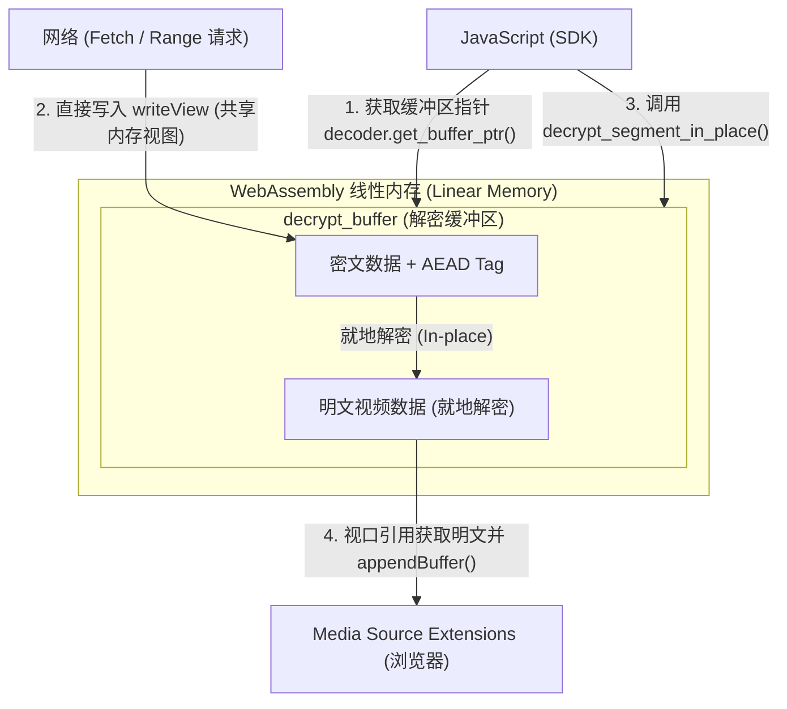

# Rustrum WASM 开发者文档

Rustrum WASM 模块是 Rustrum 安全视频流播放体系的加解密与元数据解析核心。它使用 Rust 编写，通过 `wasm-bindgen` 编译为 WebAssembly (WASM) 二进制文件，并运行于浏览器环境中，为前端 SDK 提供高性能的密钥派生、密文头解析及零拷贝就地解密能力。

## 构建与集成

### 1. 编译 WASM 模块

使用 `wasm-pack` 构建工具将 `crates/rustrum-wasm` 编译为适用于浏览器的 ESM 模块：

```bash
wasm-pack build --target web --out-dir ../../packages/sdk/src/pkg
```

编译输出包含以下产物：
- `rustrum_wasm.js`：WASM 模块的 JS 胶水代码，负责加载和封装导出接口。
- `rustrum_wasm_bg.wasm`：编译后的 WebAssembly 二进制字节码。
- `rustrum_wasm.d.ts`：TypeScript 类型定义文件。

## API 接口参考

WASM 模块导出了多个顶层函数 and 核心类，用于控制解密管线的全生命周期。

### 顶层函数

#### 1. init_panic_hook()
初始化 Panic 挂钩。在开发环境下，该函数可将 WASM 内部的 Rust Panic 堆栈信息完整输出到浏览器的控制台，便于调试。
```typescript
export function init_panic_hook(): void;
```

#### 2. parse_header(header_bytes: Uint8Array)
解析 `.rstrm` 索引文件的二进制头部数据，返回一个 `WasmRstrHeader` 实例。
```typescript
export function parse_header(header_bytes: Uint8Array): WasmRstrHeader;
```

#### 3. derive_key(password: string, salt: Uint8Array)
使用 Argon2id 算法从用户输入的密码和盐值（16 字节）中派生出对称加密所需的解密密钥。
```typescript
export function derive_key(password: string, salt: Uint8Array): Uint8Array;
```

#### 4. decrypt_chunk(cipher_id: number, key: Uint8Array, nonce: Uint8Array, encrypted_data: Uint8Array)
对单个密文分块进行解密（这会产生一次内存分配，适合解密小体积的独立数据）。
- `cipher_id`：算法 ID（1 代表 ChaCha20-Poly1305，2 代表 AES-256-GCM，3 代表 AES-128-GCM）。
- 返回解密后的明文字节数组。
```typescript
export function decrypt_chunk(
  cipher_id: number,
  key: Uint8Array,
  nonce: Uint8Array,
  encrypted_data: Uint8Array
): Uint8Array;
```

---

### WasmRstrHeader 类

用于表达解析后的视频元数据和分片索引表。

#### 属性（Getter）
- `version: number`：视频流加密协议版本号。
- `cipher_id: number`：所用的对称加密算法 ID。
- `is_split: boolean`：是否为物理分段多文件模式。
- `duration: number`：视频总时长（秒）。
- `mime_type: string`：视频的 MIME 格式与 Codecs 编码标识。
- `key_salt: Uint8Array`：派生密钥所用的随机盐值。
- `index_count: number`：分片索引表中的总项数（包含 Init Segment 和各个 Media Segment）。

#### 方法
- `get_entry_offset(index: number): bigint | undefined`：获取指定分片在密文媒体源文件中的物理偏移量。
- `get_entry_size(index: number): bigint | undefined`：获取指定分片对应的加密数据大小（字节）。
- `locate_chunk(byte_position: number): number`：根据给定的未加密字节位置，定位对应的分片索引。如果定位失败，返回 `-1`。
- `locate_chunk_by_time(current_time: number, duration: number): number`：根据当前播放时间（秒）以及视频总时长，计算并返回应当播放的分片索引。

---

### WasmDecoder 类

解密器的核心控制器，内部持有解密密钥和专用的零拷贝缓冲区。

#### 构造函数
```typescript
export class WasmDecoder {
  constructor(header_bytes: Uint8Array, password: string);
}
```
- `header_bytes`：`.rstrm` 索引文件的二进制内容。
- `password`：解密密码。构造函数内部会自动执行密钥派生，并根据索引表中最大分片的大小预先分配 WASM 线性内存缓冲区。

#### 属性（Getter）
`WasmDecoder` 提供了与 `WasmRstrHeader` 几乎一致的 Getter 属性以方便直接查询元数据（如 `mime_type`、`version`、`cipher_id`、`is_split`、`duration` 等）。

#### 零拷贝解密核心方法

##### 1. get_buffer_ptr()
获取预分配的解密缓冲区的内存指针（WASM 线性内存地址）。
```typescript
export function get_buffer_ptr(): number;
```

##### 2. decrypt_segment_in_place(index: number, encrypted_len: number)
对当前缓冲区内的密文进行就地 (In-place) 解密。
- `index`：目标分片在索引表中的位置。
- `encrypted_len`：写入缓冲区的密文长度。
- 返回解密后的明文有效长度。
```typescript
export function decrypt_segment_in_place(index: number, encrypted_len: number): number;
```

---

## 零拷贝共享内存工作流

为避免在 JavaScript 堆与 WebAssembly 堆之间复制大体积的视频数据，Rustrum 采用了共享内存环形缓冲区设计：




### 详细步骤

1. **获取缓冲区指针**：
   JavaScript 侧通过调用 `decoder.get_buffer_ptr()` 获取 WASM 内部缓冲区的内存首地址（例如设为 `ptr`）。

2. **建立网络写入视口**：
   在发起分片拉取请求时，直接通过 WASM 线性内存的 `ArrayBuffer` 建立一个指定范围的 `Uint8Array` 视图：
   ```javascript
   const wasmMemory = wasmInstance.memory.buffer;
   const writeView = new Uint8Array(wasmMemory, ptr, encrypted_len);
   ```

3. **网络响应直接写入**：
   利用 `fetch` 流式读取或 `response.arrayBuffer()` 配合 `Uint8Array.set` 将网络请求下载的密文数据直接填充至 `writeView`。数据在此步被直接写入 WASM 内部内存，没有额外的 JS 垃圾回收开销。

4. **就地解密**：
   调用 `decoder.decrypt_segment_in_place(index, encrypted_len)`。WASM 内部会通过对应的 AEAD 算法对这块内存区域进行解密，验证完整性，并将密文和 Tag 原地覆写为解密后的明文数据。

5. **获取明文并送入 MSE**：
   解密成功后，JavaScript 从相同的指针地址获取明文视图（长度为 `decrypted_len`）：
   ```javascript
   const plainView = new Uint8Array(wasmMemory, ptr, decrypted_len);
   // 直接送入浏览器播放管道，不产生冗余内存拷贝
   sourceBuffer.appendBuffer(plainView);
   ```

## 关联参考

- [系统总体设计说明](../DESIGN.md)
- [前端 SDK 接入指南](./sdk.md)
